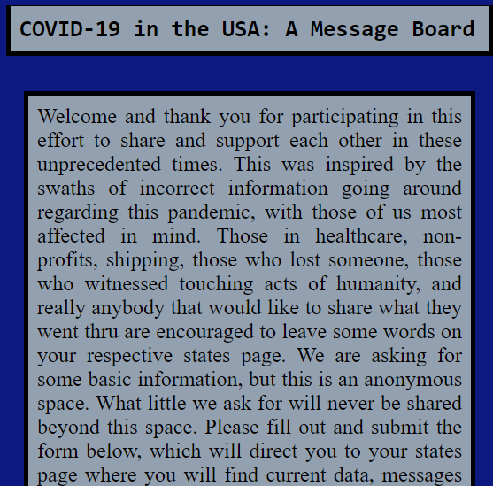
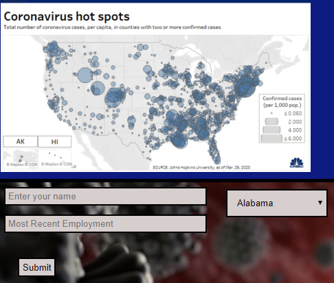

# COVID-19 in the US - an anonymous message board

### [Live! Try it out here!](https://corona-message-board-us.now.sh/state/10)
### [Server-side API repo and Docs!](https://github.com/thinkful-ei-macaw/covid-19-server-bleek)

## Application Summary

This message board application is a creation inspired by my reverence for the people and organizations that have came to meet the moment, in a concerted effort at minimizing human suffering due to the global COVID-19 pandemic. In the face of a stalled, seemingly incompetent response from the US Federal Government and an internet disinformation campaign of crack-pot theories surrounding the pandemic, there's some bright lights shining thru the dark. From the non-profits that have put cash directly in the hands of many laid-off Americans, to the unsung individuals that stock our grocery stores and care for our sick and injured, this was made with them in mind as a place that the people of the US can anonymously speak on what's been seen, done, and endured on an individual level. It's of no matter if this new reality has affected you greatly or minimally, come be a part of the conversation.

#### Coronavirus has affected all of us in myriad ways, between minimal and massive: regardless, come talk about it and learn how others have too...

Users can select what 1 of the 54 U.S States and territories they live, their name, and their most recent employment field. The user will be guided to their states page that displays current data available for that states COVID-19 infections and fatalities (sourced by state and federal reporting agencies that are updated ever business day by 4PM) and may leave an anonymous account of how it affected them, while seeing how it has affected their neighbors who visited before them.

# Technical Stack

An anonymous message board web app, using React client and Node.js server. Client codebase features dynamic component routing with React Router, sharing data between components using React Context, form input validation, and AJAX request in async/await function syntax. Also, SASS styles sheets(instead of vanilla CSS), with variable declarations for the "defaults" like color schemes and borders.
Server codebase features include the Express.JS library, and Knex.JS pairing up to PostgreSQL relational databases. Features

