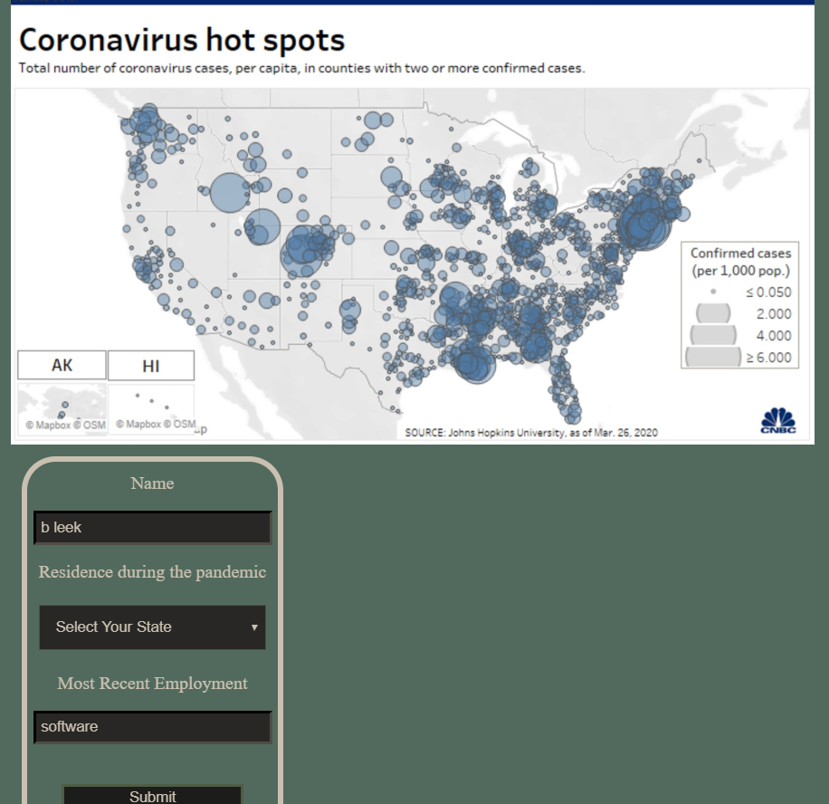
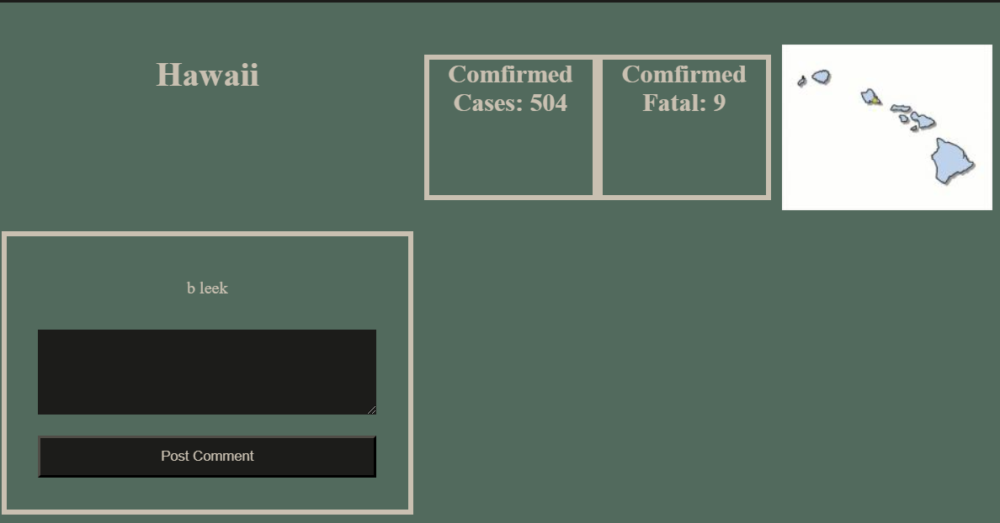

# COVID-19 in the US - an anonymous message board

### [Try it out here!]https://corona-message-board-us.now.sh/state/10

## Coronavirus has affected all of us in myriad ways, whether minimal or massive: regardless, come talk about it and learn how others have too...
Users can select what 1 of the 54 U.S States and territories they live, their name, and their most recent employment field. The user will be guided to their states page that displays current data available for that states COVID-19 infections and fatalities (sourced by state and federal reporting agencies that are updated ever business day by 4PM) and may leave an anonymous account of how it affected them, while seeing how it has affected their neighbors who visited before them.

# Technical Stack

JavaScript web app in a React.JS client and a Node.JS server. Client codebase features dynamic component routing with React Router, sharing data between components using React Context, and reader friendly server requesting with async/await function syntax.
Server codebase features include the Express.JS library, for unopinonated and readable response routing, and Knex.JS pairing up to PostgreSQL relational databases.

